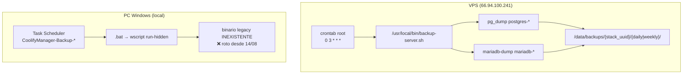

# Incidente de backups: dos sistemas, uno roto (Windows) y uno operativo (VPS)

> **Fecha**: 27/08/2026 (investigación) · **Clasificación**: incidente de operaciones/backups
> **Alcance**: sistema de backups de todos los sitios desplegados en VPS1 (66.94.100.241, Coolify 4.0.0-beta.460)
> **Herramientas**: `coolify-manager-rs` v1.0.0 (binario `C:\tmp\glory-target\coolify-manager\release\coolify-manager.exe`)

---

## 1. Resumen ejecutivo (actualizado)

**Hay DOS sistemas de backups independientes:**

1. **Sistema del VPS (`backup-server.sh` + crontab root)** — ✅ **OPERATIVO**:
   - Crontab: `0 3 * * * /usr/local/bin/backup-server.sh` (diario 03:00 UTC).
   - Corre en el servidor, **independiente del PC Windows**.
   - Log `/data/backups/backup.log`: `BACKUP RUN` **diario** con `total=8-9 errors=0` (verificado 16→27/08).
   - Dumps `.sql.gz` por stack UUID con **datos reales** (studio 27/08: 7 proyectos, 14 usuarios, 8954 filas infra).
   - Script coincide con el repo del manager (hash `2d58f4c6a7a46e19867c22a9843ef0e2`).
   - **El backup de studio del 27/08 01:00 tiene TODOS los datos** (capturado ANTES del incidente de reinicialización de las 23:35) — es la **mejor fuente de restauración**.

2. **Sistema de Windows (Task Scheduler → binario legacy)** — ❌ **ROTO desde ~14/08**:
   - Las tareas `CoolifyManager-Backup-*` apuntan a un binario legacy que **ya no existe**.
   - Último backup legacy: `20260813_*` (13/08).
   - **Este era un sistema redundante paralelo, NO el único.** Su fallo no dejó los datos sin protección.

**Conclusión**: los backups **SÍ están programados en el VPS** y **siguen funcionando**. El fallo del 13/08 afectó solo al sistema de Windows (redundante). La pérdida de datos de `studio` se debe al incidente de reinicialización del PGDATA (27/08 23:35), pero **el backup del VPS del 27/08 01:00 contiene los datos** y permite restaurar.

- **`kamples`, `glory-rest` y `agape` NO tienen pérdida de datos** (verificado: tablas, filas y fechas pre-incidente intactas).
- **El backup del 13/08 de `studio` (sistema legacy Windows)** es utilizable como fuente alternativa (280 MB, `db-postgres.sql` con `public.projects` + uploads).
- **`kamples` no generaba backups en el sistema legacy** porque su directorio nunca existió, pero **el sistema del VPS sí lo respalda** (41 tablas, dump del 27/08).

---

## 2. Mapa de sitios y estado actual

| Sitio | Template | UUID | Backup VPS (27/08) | Backup legacy Windows (13/08) | Estado BD | ¿Pérdida? |
|---|---|---|---|---|---|---|
| guillermo | wordpress | `owck8sww4ogk8gskgwcsk4w0` | mariadb-owck8… ✅ | 20260813_030007 | Volumen intacto (157.5M) | NO |
| padel | wordpress | `zkcc040cc0scock4kcooowkc` | mariadb-zkcc… ✅ | 20260813_031513 | Volumen intacto (777.3M) | NO |
| wandori | wordpress | `csoc88c0gw8kc4cwcwosc48s` | mariadb-csoc… ✅ | 20260813_033004 | Volumen intacto (159M) | NO |
| nakomi | wordpress | `u00gc8ss4csc4cckkg4g00ks` | mariadb-u00g… ✅ | 20260813_034549 | Volumen intacto (236.6M) | NO |
| cap | wordpress | `qgskgw8wwc08o444o08wko8o` | mariadb-qgsk… ✅ | 20260813_040010 | Volumen intacto (160M) | NO |
| studio | rust | `do8k4w8swccwwogoc0os0ck0` | **do8k4w8… 27/08 (391KB, datos)** ✅ | 20260813_041523 | **PGDATA reinicializado 27/08** (volumen anónimo `0f19bac…`) | **BD viva sí, pero restaurar desde backup VPS 27/08** |
| kamples | rust | `mo4so4440c488g8woow4cow0` | **mo4so44… 27/08 (19.8KB, datos)** ✅ | SIN BACKUPS | Intacto (68.3M, 41 tablas) | NO |
| glory-rest | rust | `b8s0cks444o0sogo8kg8wcgw` | **b8s0cks… 27/08 (16.6KB, datos)** ✅ | 20260813_050009 | Intacto (65.1M, 40 tablas) | NO |
| agape | rust | `zgw440o8kowokcoww8s0csws` | **zgw440o8… 27/08 (9.3KB, datos)** ✅ | SIN BACKUPS | Intacto (47.1M, 13 tablas) | NO |
| task | rust | `j4skk8skkcw8g0gsgs4w0gw8` | (nuevo 27/08) | SIN BACKUPS | Intacto (47.4M) | NO (nuevo) |

> **Nota**: `cresta` tiene tarea programada en Windows pero no se verificó su backup en esta investigación.

---

## 3. El sistema de backups del VPS (operativo)

### 3.0. Arquitectura: dos sistemas independientes



- **VPS**: script embebido en `coolify-manager-rs` (`scripts/backup-server.sh`), instalado con `install-backups`. Auto-descubre containers postgres/mariadb. Crontab diario 03:00 UTC. **Funciona sin el PC Windows.**
- **Windows (legacy)**: tareas del Task Scheduler que ejecutaban el binario del manager local. **Roto desde ~14/08** (binario eliminado).

### 3.1. Verificación del sistema VPS (27/08)

- Crontab root: `0 3 * * * /usr/local/bin/backup-server.sh >> /data/backups/backup.log 2>&1`
- Script: `/usr/local/bin/backup-server.sh` (10 KB, hash `2d58f4c6a7a46e19867c22a9843ef0e2` — coincide con el repo).
- Log: `BACKUP RUN` **diario** con `total=8-9 errors=0` (verificado 16→27/08, cada día).
- Dumps por stack UUID con datos:
  - studio `do8k4w8…`: 27/08 = **391 KB** (7 proyectos, 14 users, 8954 infra samples)
  - glory-rest `b8s0cks…`: 27/08 = 16.6 KB (40 tablas)
  - kamples `mo4so44…`: 27/08 = 19.8 KB (41 tablas)
  - agape `zgw440o8…`: 27/08 = 9.3 KB (13 tablas)
- Rotación: `daily_keep=2`, `weekly_keep=2` (conserva los 2-3 más recientes).

### 3.2. ¿Por qué solo hay dumps del 16, 23, 26 y 27?

El script rota (`kept=2`), así que elimina los antiguos. El log demuestra que **corrió todos los días** (`BACKUP RUN` diario 16→27/08), pero solo sobreviven los 2-3 más recientes en disco.

---

## 4. ¿Por qué se rompió el sistema de Windows después del 13/08?

### 4.1. Causa raíz: binario legacy inexistente

Las tareas del Programador de tareas de Windows (`CoolifyManager-Backup-Daily-<sitio>` y `Weekly-*`) ejecutan un `.bat` que apunta a:

```
C:\Users\Owner\OneDrive\Documentos\WP\app\public\wp-content\themes\glorytemplate\.agent\coolify-manager-rs\target\release\coolify-manager.exe
```

**Este archivo NO existe** (`Test-Path` = `False`). Solo queda:

```
...\target\release\deps\coolify_manager.exe   (23.4 MB, 26/07/2026 10:04)
```

El directorio `target` fue modificado por última vez el **14/08/2026 03:53** — el binario fue eliminado (probablemente por una limpieza de `cargo clean`/`target`) y **nunca reconstruido**. La última noche en que el binario legacy funcionó fue la del 13/08 → por eso **todos** los últimos backups son del 13/08.

### 4.2. El resultado "0" es engañoso

Cada `.bat` hace auto-ocultamiento:

```bat
if not defined HIDDEN_RUN (
    set HIDDEN_RUN=1
    wscript.exe "run-hidden.vbs" "%~f0"
    exit /b            REM ← termina con 0 SIN ejecutar el backup
)
```

- La **primera** invocación (la que ve el Programador de tareas) lanza el script oculto y termina con `0` **sin ejecutar el backup real**.
- El backup real corre en la **segunda** invocación (ventana oculta) y su resultado **no se refleja** en el Programador de tareas.
- Por eso `LastTaskResult = 0` en casi todos los sitios **no significa** que el backup funcionara. Es el código de salida del wrapper, no del backup.
- `studio` sí muestra fallo real: `LastTaskResult = 3221225786` = `0xC000013A` (`STATUS_CONTROL_C_EXIT`, proceso abortado).

### 4.3. El PC de escritorio no siempre está encendido

Todas las tareas muestran última ejecución `27/08/2026 11:05:37` (cuando el PC estaba encendido), **no** a su hora programada (03:00–05:00). El Programador de tareas ejecuta las tareas atrasadas al arrancar el PC (catch-up), pero si el PC está apagado a las 3–5 AM y el catch-up falla (o el binario no existe), el backup no se genera.

### 4.4. Cadena de fallo del sistema Windows (legacy)

```
14/08: se elimina target\release\coolify-manager.exe (binario legacy)
   ↓
Las tareas .bat apuntan a ese binario inexistente
   ↓
Los .bat salen con 0 (auto-ocultamiento) → el fallo queda oculto
   ↓
Ningún backup LEGACY se genera después del 13/08
   ↓
(El sistema VPS SIGUE funcionando — los datos no quedaron sin protección)
```

> **Nota importante**: el fallo del sistema Windows NO dejó los datos sin backup, porque el sistema VPS seguía (y sigue) corriendo en paralelo.

---

## 5. Restauración de `studio` — dos fuentes disponibles

### 5.1. Fuente principal: dump del VPS (27/08 01:00) ⭐ RECOMENDADA

**Ubicación remota**: `/data/backups/do8k4w8swccwwogoc0os0ck0/daily/2026-08-27_0100.sql.gz` (391 KB)

**Contenido verificado** (dump con datos completos):
- `public.projects`: **7 proyectos** (KAMPLES, MABUHAY, Task Manager, Material de Pádel, Rest, etc.)
- `public.users`: 14 usuarios
- `public.infrastructure_resource_samples`: 8954 filas
- `chat_messages`: 71, `orders`: 2, `services`: 6, `service_plans`: 16, etc. (57 tablas con datos)

**Cuándo se capturó**: 27/08 01:00 UTC — **ANTES** del incidente de reinicialización del PGDATA (27/08 23:35). Por tanto contiene los datos pre-incidente.

> Este dump del VPS es **más reciente y completo** que el legacy del 13/08. Es la fuente recomendada para restaurar studio.

### 5.2. Fuente secundaria: backup legacy Windows (13/08)

**Ubicación remota**: `/data/backups/coolify-manager/studio/daily/20260813_041523.tar.gz` (**280 MB**)

**Contenido verificado**:
- `db-postgres.sql` (1.9 MB) con esquema completo: tablas `public.projects`, `orders`, `services`, `users`, etc. (PG 16.14, owner `rust_app`)
- `files-app_uploads.tar.gz` (279 MB) — uploads de la app

**Qué restaura**: los proyectos de nakomi.studio hasta el **13/08/2026 04:15**. Pérdida estimada entre el 14 y el 27 de agosto (~14 días) no está en el backup y no es recuperable salvo otra fuente externa.

> ⚠️ El backup legacy **incluye uploads** (`files-app_uploads.tar.gz`, 279 MB) que el dump VPS del 27/08 no incluye. Si se necesitan los archivos subidos, combinar: restaurar BD desde VPS 27/08 + uploads desde legacy 13/08.

**Acción recomendada (pendiente de autorización — escritura remota de producción)**:
```
# Restaurar BD desde el dump VPS (fuente principal, 27/08):
coolify-manager.exe restore --name studio --backup-id 2026-08-27_0100   # verificar contrato
# Alternativa: restore legacy 13/08:
coolify-manager.exe restore --name studio --backup-id 20260813_041523
```
> Contrato verificado (`restore --help`): usa `--backup-id <BACKUP_ID>` (no una ruta). Realiza snapshot de seguridad previo salvo `--skip-safety-snapshot`.

---

## 6. ¿Hubo pérdida de datos en los otros sitios?

**No.** Verificación por sitio (vía `host-exec` con `psql` dentro de cada postgres):

| Sitio | Tablas `public` | Filas vivas | Fecha más antigua | Veredicto |
|---|---|---|---|---|
| kamples | 41 | 45 | `usuarios_ext` 2026-07-02 | **Intacto** |
| glory-rest | 40 | 77 | `users` 2026-07-02 | **Intacto** |
| agape | 13 | 55 | `transparency_entries` 2026-08-26 | **Intacto** (datos creados tras el incidente) |

- **glory-rest** (`restaurante.wandori.us`): `users` desde 02/07/2026 → datos pre-incidente intactos.
- **kamples** (`samples.nakomi.studio`): 41 tablas del dominio (samples, usuarios_ext, colecciones, canciones, mensajes, transacciones…), `usuarios_ext` desde 02/07/2026 → intacto.
  - ⚠️ **Detalle**: error `could not access file "$libdir/vector"` al consultar `samples` — la BD usa la extensión `vector` (pgvector) pero el postgres actual fue recreado con una imagen **sin pgvector**. No hay pérdida de datos en tablas normales, pero las consultas con `vector` fallarán hasta reinstalar la extensión. **Pendiente de resolver.**
- **agape** (`agape.wandori.us`): 13 tablas con datos desde 26/08/2026 → el sitio se creó después del incidente (no tiene tarea de backup ni backups previos). No hay pérdida.

> Los sitios **WordPress** (guillermo, padel, wandori, nakomi, cap) tienen sus volúmenes intactos con datos reales (ver §2), así que no sufrieron pérdida.

---

## 7. ¿Por qué `kamples` no generaba backups en el sistema legacy?

- **No existe** `/data/backups/coolify-manager/kamples` en el host (el `find` devolvió vacío) → **nunca se generó un backup legacy para kamples**.
- A pesar de tener tarea programada (`CoolifyManager-Backup-Daily-kamples` y `Weekly-kamples`), el backup nunca llegó a producirse.
- Hipótesis más probable: **kamples se añadió al `settings.json` del manager después del 14/08** (cuando el binario legacy ya no existía), por lo que su tarea nunca tuvo un binario funcional. Alternativa: el backup de kamples siempre falló silenciosamente (mismo mecanismo del wrapper con salida `0`).
- **PERO**: el sistema del **VPS sí respalda kamples** — dump del 27/08 con 41 tablas (`/data/backups/mo4so4440c488g8woow4cow0/daily/2026-08-27_0100.sql.gz`). Por tanto kamples **sí tiene protección** vía VPS; solo le faltaba la redundancia legacy de Windows.

---

## 7. Estado de los backups por sitio

### Sistema VPS (`backup-server.sh`, operativo — dumps del 27/08)

| Sitio | Stack UUID | Último dump VPS | Tamaño | Datos |
|---|---|---|---|---|
| studio | `do8k4w8…` | 2026-08-27_0100 | 391 KB | ✅ 7 proyectos |
| glory-rest | `b8s0cks…` | 2026-08-27_0100 | 16.6 KB | ✅ 40 tablas |
| kamples | `mo4so44…` | 2026-08-27_0100 | 19.8 KB | ✅ 41 tablas |
| agape | `zgw440o8…` | 2026-08-27_0100 | 9.3 KB | ✅ 13 tablas |
| guillermo | mariadb-owck… | 2026-08-27_0100 | ✅ | — |
| padel | mariadb-zkcc… | 2026-08-27_0100 | ✅ | — |
| wandori | mariadb-csoc… | 2026-08-27_0100 | ✅ | — |
| nakomi | mariadb-u00g… | 2026-08-27_0100 | ✅ | — |
| cap | mariadb-qgsk… | 2026-08-27_0100 | ✅ | — |

> Rotación: `daily_keep=2`, `weekly_keep=2` — conserva los 2-3 dumps más recientes por sitio.

### Sistema legacy Windows (`coolify-manager`, roto desde 14/08 — últimos backups 13/08)

| Sitio | Último backup legacy | Ruta |
|---|---|---|
| cap | 20260813_040010 | `/data/backups/coolify-manager/cap/daily/20260813_040010.tar.gz` |
| glory-rest | 20260813_050009 | `/data/backups/coolify-manager/glory-rest/daily/20260813_050009.tar.gz` |
| guillermo | 20260813_030007 | `/data/backups/coolify-manager/guillermo/daily/20260813_030007.tar.gz` |
| nakomi | 20260813_034549 | `/data/backups/coolify-manager/nakomi/daily/20260813_034549.tar.gz` |
| padel | 20260813_031513 | `/data/backups/coolify-manager/padel/daily/20260813_031513.tar.gz` |
| studio | 20260813_041523 | `/data/backups/coolify-manager/studio/daily/20260813_041523.tar.gz` |
| wandori | 20260813_033004 | `/data/backups/coolify-manager/wandori/daily/20260813_033004.tar.gz` |
| kamples | **SIN BACKUPS legacy** | — (sí tiene VPS) |
| agape | **SIN BACKUPS legacy** | — (sí tiene VPS) |
| task | SIN BACKUPS legacy (nuevo) | — |

---

## 8. Recomendaciones / plan de acción

1. **El sistema VPS es el canónico** — ya está instalado y funcionando (`backup-server.sh` + crontab). No depende del PC Windows. **Mantenerlo y verificar su rotación.**
2. **Restaurar `studio`** desde el dump VPS del 27/08 (fuente principal; §4.1). Requiere autorización (escritura remota de producción).
3. **Decidir el destino del sistema legacy Windows**: opcional eliminarlo (tareas Task Scheduler + `.bat`) para evitar confusión, o repararlo apuntando al binario canónico como redundancia. Recomendado: **eliminarlo o dejarlo documentado como obsoleto**, porque el VPS ya cubre la función y el legacy genera resultados engañosos (`Result=0`).
4. **Verificar cobertura del VPS para `task`** (nuevo 27/08): confirmar que el auto-descubrimiento lo incluye en el próximo `BACKUP RUN`.
5. **Reinstalar pgvector** en el postgres de kamples para que la columna `vector` funcione (§5).
6. **Restaurar studio**: decidir si se restaura desde el VPS (27/08, recomendado) y verificar el contrato de restauración del dump `.sql.gz` del VPS.

---

## 9. Registro de la investigación

- **27/08**: deploy de `task` → incidente de limpieza global de contenedores exited (fix en `deploy_service.rs`, commit `eb1ce73`; ver roadmap del manager, sección "Incidente 2026-08-27").
- **27/08**: recuperación de 5 WordPress + kamples + glory-rest + agape + studio (Up, HTTP 200).
- **27/08**: diagnóstico de studio → PGDATA reinicializado 27/08 23:35.
- **27/08**: investigación del sistema legacy Windows → binario inexistente desde ~14/08.
- **27/08**: descubrimiento del sistema VPS operativo (`backup-server.sh` + crontab) → dumps diarios con datos, incluido studio 27/08 01:00 con todos los proyectos.
- **27/08**: verificación de kamples/glory-rest/agape → sin pérdida (VPS los respalda).

---

## 10. Automatización: comando `db-compare` (28/08, mejora E12)

El método manual de comparación (grep/awk/zcat sobre dumps SQL) fue reemplazado por el comando
automático `db-compare` del manager (mejora E12, ver `roadmap.md`).

**Qué hace**: compara la BD **en vivo** de un sitio contra el último **dump del VPS** (o un dump
concreto, o contra otro sitio), descubriendo **todas** las tablas automáticamente. Restaura el dump
en un **contenedor temporal efímero** (aislado, `--rm`, `--network none`) y compara con SQL real,
sin parsear texto. **Solo lectura** sobre la BD viva; el contenedor y los dumps temporales se
borran siempre (verificado: 0 residuos en producción).

**Verificación automática reproducida el 28/08 — TODOS LOS SITIOS (10/10)**, con el binario
compilado tras el fix de charset (ver abajo), siempre contra el último dump VPS (28/08 01:00):

| Sitio | Motor | Tablas | Resultado | Veredicto |
|---|---|---|---|---|
| agape | postgres | 13 | **13/13 idénticas** | ✅ Sin pérdida |
| glory-rest | postgres | 40 | **40/40 idénticas** | ✅ Sin pérdida |
| task | postgres | 23 | **23/23 idénticas** | ✅ Sin pérdida |
| kamples | postgres | 40 | 39/40 + `algoritmo_estado` (solo `ultimo_rapido`) + `samples` solo_en_vivo (tabla nueva post-dump) | ✅ Sin pérdida |
| nakomi | mariadb | 39 | **38/39** + `wp_options` (12 diffs cron/transients) | ✅ Sin pérdida |
| wandori | mariadb | 14 | 13/14 + `wp_options` (6 diffs cron/transients) | ✅ Sin pérdida |
| cap | mariadb | 21 | 20/21 + `wp_options` (16 diffs cron/transients) | ✅ Sin pérdida |
| padel | mariadb | 27 | 25/27 + `wp_comments` (1 fila NUEVA en vivo: spam ID=15 post-dump) + `wp_options` (20 diffs) | ✅ Sin pérdida |
| guillermo | mariadb | 12 | 11/12 + `wp_options` (14 diffs cron/transients) | ✅ Sin pérdida |
| studio | postgres | 56 | **53/56** + 3 con diffs de **telemetría/timestamps** | ✅ **Sin pérdida de datos de negocio** |

**VEREDICTO FINAL: NO HAY PÉRDIDA DE DATOS en ninguno de los 10 sitios.** Todos los diffs
son: (a) timestamps/transients volátiles (`cron`, `_transient_*`, `_site_transient_*`,
`updated_at`), (b) filas **nuevas en vivo** posteriores al dump (p. ej. el comentario spam de
padel a las 02:47 vs dump de 01:00), o (c) tablas **creadas después del dump** (`samples` en
kamples). En ningún caso falta una fila en la BD viva.

**Hallazgo relevante sobre studio**: las únicas diferencias con el dump son:
- `infrastructure_resource_samples`: 253 vs 99 (154 filas de **muestreo de telemetría** nuevas,
  datos de monitoreo que se regeneran, no datos de negocio).
- `infrastructure_servers` y `server_capacity`: mismas 2 filas, solo difieren `updated_at`
  (timestamp de la última verificación).

→ Las tablas de negocio de studio (proyectos, usuarios, etc.) están **intactas** en la BD viva.
Esto **matiza el diagnóstico del incidente**: no hay pérdida de datos de negocio en studio; la
"reinicialización del PGDATA" no eliminó datos de negocio (o se recuperaron). El dump del 27/08
sigue disponible como fuente de restauración si se necesita volver atrás.

**Fix de charset encontrado durante esta verificación** (commit `f68a53f`): el cliente `mariadb`
del contenedor vivo devolvía los emojis UTF-8 de 4 bytes como `?` solo en el lado vivo, lo que
producía **falsos positivos de diferencia**. Se añadió `--default-character-set=utf8mb4` a la
extracción. Ejemplo del impacto: nakomi pasó de 27/39 a **38/39** tablas idénticas con el fix.

**Cómo usar** (documentación completa en `README.md` § `db-compare`):

```bash
# Verificación de un sitio contra el último dump VPS (solo lectura):
coolify-manager db-compare --name studio --json

# Modo ligero (sin contenedor temporal, mínima carga):
coolify-manager db-compare --name agape --no-tmp-container --json
```

**Bugs corregidos durante la implementación** (28/08):
1. `find_latest_vps_dump` no encontraba dumps de stacks MariaDB (`/data/backups/mariadb-{uuid}/`
   vs `/data/backups/{uuid}/`).
2. `JSON_OBJECT` de MariaDB se rompía porque los backticks se interpretaban como command
   substitution del host — ahora el SQL se envía por **base64** (patrón `pg_utils::run_pg_query`).
